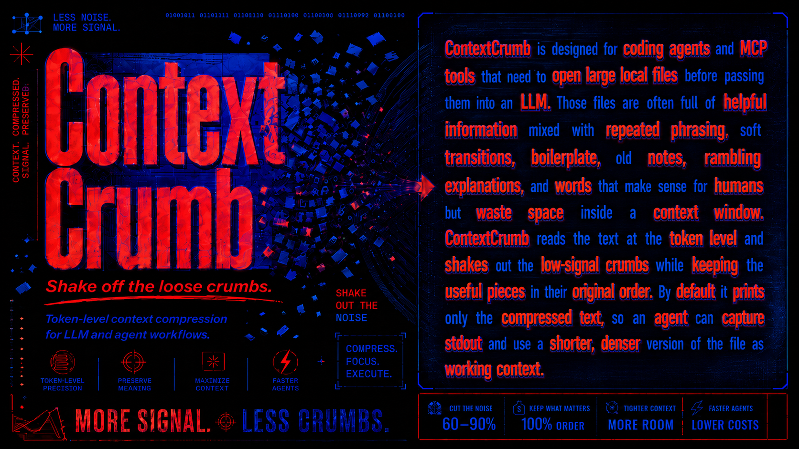

<h1 align="center">ContextCrumb</h1>
<p align="center">
  <strong>Shake the crumbs out of bloated context.</strong>
</p>
<p align="center">
  
</p>


<p align="center">
  <!-- <a href="https://huggingface.co/ymao20/contextcrumb-32m"></a> -->
  <a href="https://huggingface.co/ymao20/contextcrumb-32m"></a>
  <a href="https://pypi.org/project/contextcrumb/"></a>
  <!-- <a href="https://huggingface.co/ymao20/contextcrumb-32m"></a> -->
  <a href="https://github.com/Yuchen20/Context-Crumb/stargazers"></a>
  <a href="https://github.com/Yuchen20/Context-Crumb/commits/main"></a>
  <!-- <a href="LICENSE"></a> -->
  
  =3.10">
</p>

<p align="center">
  <a href="#before-after">Before / After</a> -
  <a href="#quickstart-30-second-setup">Quickstart</a> -
  <a href="https://huggingface.co/spaces/ymao20/contextcrumb-32m-demo">Playground</a> -
  <a href="#install">Install</a> -
  <a href="#cli">CLI</a> -
  <a href="#agent-mcp">Agent + MCP</a> -
  <a href="#model">Model</a>
</p>

---

LLM context gets messy fast: notes, logs, issue threads, docs, research dumps, and tool descriptions all pile up until the useful signal is buried under filler.

**ContextCrumb** is a token-level compressor for LLM and agent workflows. It looks at text word by word and removes low-signal tokens while keeping the surviving text in the original order.

That is the idea behind the name: the context is still there, but the loose crumbs are shaken off before they reach your model. Less bloat in the prompt. More room for the parts that matter. Less wasted usage when Codex, Claude Code, or another agent processes long files repeatedly.

<p align="center">
  <a href="https://huggingface.co/spaces/ymao20/contextcrumb-32m-demo">
    
  </a>
  <br />
  <sub>No install needed. Paste text, compare the kept context, and see what gets shaken off.</sub>
</p>

<h2 id="before-after">Before / After</h2>

ContextCrumb is not a summarizer. It does not rewrite your document into a new explanation. It keeps the source sequence and deletes expendable words. This example uses `target_keep_ratio=0.72`.

**Original**

```text
Agents spend context on notes, logs, tickets, docs, and tool descriptions. Those files contain useful facts, but they also carry filler phrases and repeated wording. ContextCrumb compresses the text before it reaches the model. It keeps the original order, removes low-value tokens, and leaves a shorter version with the names, actions, constraints, and sequence still intact.
```

**Compressed**

```text
Agents spend context notes, logs, tickets, docs tool descriptions. Those files useful facts, carry filler phrases repeated wording. ContextCrumb compresses text before reaches model. keeps original order, removes low-value tokens, leaves shorter version names, actions, constraints sequence intact.
```

Same order. Less padding. More room for the next file. On prose-heavy agent inputs, ContextCrumb often saves around **30-70% of the context** depending on how aggressively you compress and how much filler is in the source.

| Metric | Original | Compressed | Saved |
| --- | ---: | ---: | ---: |
| Model tokens | 72 | 52 | 20 tokens |
| Token budget | 100% | 72% | 28% fewer input tokens |

**What that feels like over a month**

Assume your agent reads 8k-token notes, logs, tickets, research dumps, or docs before answering. This helps with API token bills, but also with subscription-based coding agents where heavy context reads can burn through usage faster.

| Workflow | Files read / day | Context saved / month | API cost avoided at $5 / 1M input tokens | Subscription usage feel |
| --- | ---: | ---: | ---: | --- |
| Solo agent helper | 20 | ~1.4M-3.4M tokens | ~$7-$17 | Fewer bulky reads in Codex or Claude Code |
| Busy project workspace | 200 | ~14M-34M tokens | ~$72-$168 | More room for actual reasoning and edits |
| Agent-heavy team or eval loop | 2,000 | ~144M-336M tokens | ~$720-$1,680 | Less usage spent processing padded files |

The bigger win is usually not only the bill. It is keeping long-running agents from filling their context, turns, and subscription usage with words they did not need to carry in the first place.

<h2 id="quickstart-30-second-setup">Quickstart (30-second setup)</h2>

Teach your agent a small habit: compress the bloat before it enters context. ContextCrumb is meant to sit in the background as a skill, stepping in whenever a long note, doc, issue thread, research dump, or log would otherwise flood the context window and eat into your Codex or Claude Code usage.

1. Add the skill.

```bash
npx skills add Yuchen20/Context-Crumb
```

2. Select the agent you want to install it on.

The skill tells your agent when to compress text, how to preserve the useful sequence, when supported code can be loaded with comment/docstring compression, and when exact raw text is required for configs, direct quotes, or exact edits.

3. Use ContextCrumb to compress long files instead of dropping the whole thing into context.

```text
Use ContextCrumb to compress this long project note before you work from it.
```

4. Voila: every long note, log, ticket, research dump, or doc enters context already trimmed, saving tokens and preserving more of your agent subscription for the work that matters.

## Why ContextCrumb?

| Use case | What changes |
| --- | --- |
| Agent file loading | Compress long notes, docs, research dumps, and logs before they hit the context window. |
| Prompt pipelines | Shrink natural-language inputs without hand-writing summarizers. |
| MCP catalogs | Compress verbose tool/resource descriptions while preserving names and schemas. |
| Local workflows | Run ONNX inference by default, with cached model files after first download. |
| Subscription-aware agents | Spend less Codex or Claude Code usage on repeatedly loading padded prose. |
| Inspection and tuning | Use `diff` and `inspect` to see what was kept, deleted, and saved. |

Best fit: docs, notes, issue threads, logs, research context, other natural-language files, and supported source files where only comments/docstrings should be shortened. For exact code edits or exact comments, read the raw source.

<h2 id="install">Install</h2>

```bash
pip install contextcrumb
```

Optional extras:

```bash
pip install "contextcrumb[mcp]"
pip install "contextcrumb[serve]"
pip install "contextcrumb[torch]"
```

ContextCrumb uses the ONNX backend by default, so normal users do not need PyTorch or Transformers installed. Model files are cached locally after the first download.

<h2 id="cli">CLI</h2>

The main agent-friendly command is `load`:

```bash
contextcrumb load notes.txt
```

It prints only compressed text by default, which makes it easy for agents, hooks, shell scripts, and prompt pipelines to capture stdout and move on. For subscription tools like Codex or Claude Code, that means fewer bulky file reads before the agent gets to the useful part.

Useful commands:

```bash
contextcrumb load notes.txt --json
contextcrumb load notes.txt --receipt
contextcrumb config set compression.content_mode auto
contextcrumb diff notes.txt
contextcrumb inspect notes.txt
contextcrumb stats
```

`--receipt` leaves compressed text on stdout and writes a compact savings receipt
to stderr. ContextCrumb uses `compression.content_mode = "auto"` by default:
prose files are compressed normally, while supported code files use a
code-aware path that preserves executable source exactly and compresses only
comments/docstrings. Unsupported syntax-sensitive files such as diffs, configs,
lockfiles, SQL, and `.env` files are still refused unless you pass `--force`;
forced output is only for exploratory reading, not exact edits or copy-paste
commands.

Persistent defaults live in user config and can be changed from the CLI:

```bash
contextcrumb config show
contextcrumb config set compression.content_mode code-comments
contextcrumb config set code.comment_target_keep_ratio 0.55
contextcrumb config unset compression.content_mode
```

Supported file modes:

| Mode | Behavior |
| --- | --- |
| `auto` | Prose uses normal compression; supported code uses `code-comments`. |
| `prose` | Treat the whole input as natural language. |
| `code-comments` | Preserve executable code exactly and compress only comments/docstrings. |
| `raw` | Return the file unchanged with stats. |
| `refuse` | Reject file compression. |

Initial code-aware languages: Python, JavaScript, TypeScript, JSX, TSX, Go, and
Rust.

`diff` marks deleted tokens like this:

```text
kept words [-deleted words-] kept words
```

<h2 id="agent-mcp">Agent + MCP</h2>

ContextCrumb includes an optional MCP stdio adapter for agent clients that can run Python tools through `uvx`.

```bash
pip install "contextcrumb[mcp]"
```

Published-package MCP config:

```json
{
  "mcpServers": {
    "contextcrumb": {
      "command": "uvx",
      "args": [
        "--from",
        "contextcrumb[mcp]",
        "contextcrumb-mcp"
      ]
    }
  }
}
```

The MCP server exposes:

```text
compress_text
compress_file
```

ContextCrumb also ships `contextcrumb-shrink`, an MCP proxy that compresses verbose catalog descriptions before an agent sees them while forwarding tool names, schemas, calls, results, and resource contents unchanged. This is useful when an agent client repeatedly spends context and subscription usage just looking at long tool descriptions.

<h2 id="model">Model</h2>

Model weights and a hosted demo are public on Hugging Face:

- Model: [ymao20/contextcrumb-32m](https://huggingface.co/ymao20/contextcrumb-32m)
- Playground: [contextcrumb-32m-demo](https://huggingface.co/spaces/ymao20/contextcrumb-32m-demo)

## Roadmap

Planned for later:

- Public docs for advanced compression modes and service deployment.
- JavaScript or TypeScript client.
- Hosted API experiments.
- npm publishing.

## Development

```powershell
uv pip install --python .\.venv\Scripts\python.exe -e ".[dev,mcp]"
.\.venv\Scripts\python.exe -m pytest
.\.venv\Scripts\python.exe -m build
```

Release notes are tracked in [CHANGELOG.md](CHANGELOG.md).

## License

MIT. See [LICENSE](LICENSE).
